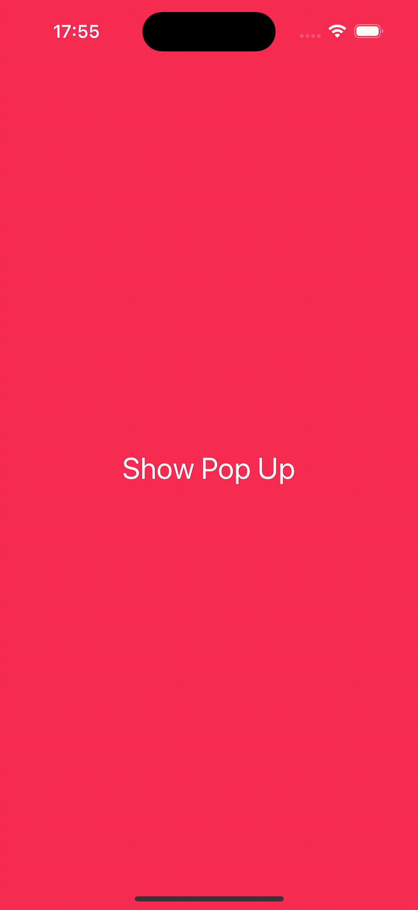

# PopUp
SwiftUI simple pop up view implementation:
 


## Installing
PopUp Library can be installed using Swift Package Manager.

Use the package URL to search for the PopUp package: [https://github.com/maxgribov/PopUp](https://github.com/maxgribov/PopUp)

For how-to integrate package dependencies refer to [Adding Package Dependencies to Your App documentation.](https://developer.apple.com/documentation/xcode/adding-package-dependencies-to-your-app)

## Usage

### Show

You can easily present a pop up with `View` modifier [popUp](Sources/Popup/View%2Bext.swift#L76). This is very similar how to present a sheet:

 ```swift
 struct CustomAlertModel: Identifiable {
     var id: UUID = UUID()
     let title: String
     let message: String
 }

 struct ContentView: View {
     @State var customAlert: CustomAlertModel?
     var body: some View {
         
         Button("Show custom alert") {
             customAlert = CustomAlertModel(
                 title: "Pop Up",
                 message: "Some message here..."
             )
         }
         .popUp(item: $customAlert) { viewModel in
             CustomAlert(viewModel: viewModel)
         }
     }
 }

 struct CustomAlert: View {
     let viewModel: CustomAlertModel
     var body: some View {
         VStack {
             Text(viewModel.title)
                 .font(.title)
             Text(viewModel.message)
         }
         .padding(40)
         .background(
             RoundedRectangle(cornerRadius: 30)
                 .foregroundStyle(.white)
         )
     }
 }
 ```
### Customise

There are few methods that you can use to customise look and behaviour of the pop up:
- [popUpBackgroundMaterial](Sources/Popup/Settings/BackgroundMaterial.swift#L35): updates material for the dim view under the pop up view.
- [popUpPresentAnimation](Sources/Popup/Settings/PresentAnimation.swift#L34): replaces the animation for the pop up show up.
- [popUpDismissAnimation](Sources/Popup/Settings/DismissAnimation.swift#L34): replaces the animation for the pop up dismiss.
- [popUpDismissOnBackgroundTap](Sources/Popup/Settings/DismissOnBackgroundTap.swift#L34): enables or disables the pop up dismissal on user tap at the dim view outside of the pop up view.

#### Example:
 ```swift
 struct ContentView: View {
     @State var customAlert: CustomAlertModel?
     var body: some View {
         
         Group {
             // ...
         }
         .popUp(item: $customAlert) { viewModel in
             CustomAlert(viewModel: viewModel)
         }
         .popUpBackgroundMaterial(.ultraThin)
     }
 }
 ```
 
## Notes

> PopUp does not have any background or a style for the content (like the system alert view is for example). The look of your popup you have implement by yourself.

> This is not a modal view (like a sheet for example). It can not cover views above it.

> It is possible to open many pop ups one above other. There is no limitations like for the sheet.

## System Requirements

**Swift 5.9**
* iOS 15+
* macOS 12+

## License

This project is licensed under the MIT License - see the [LICENSE](LICENSE) file for details
